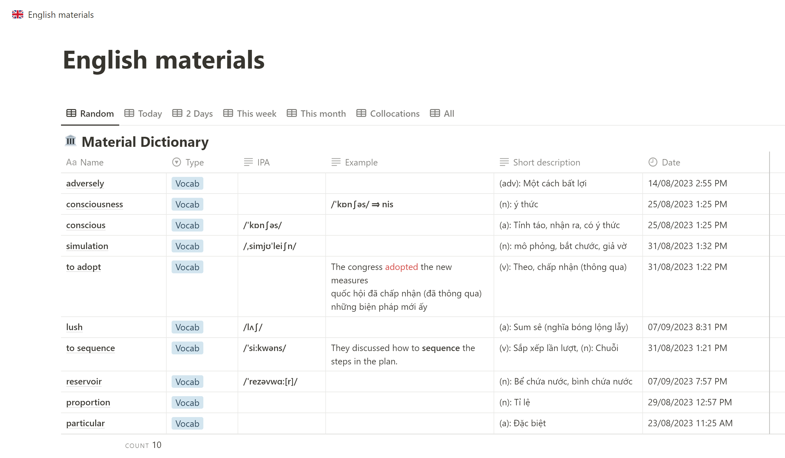
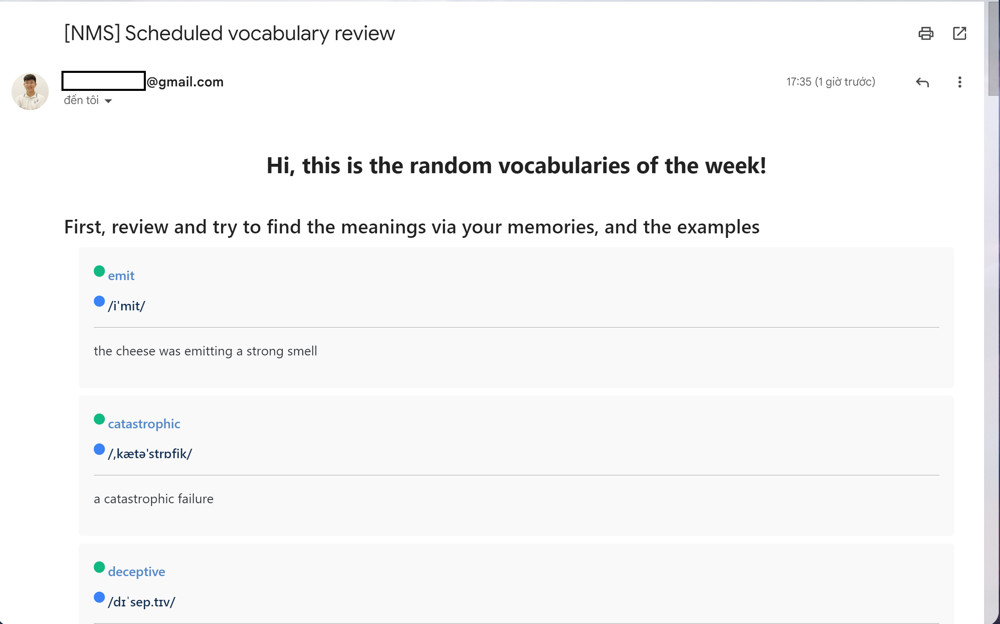
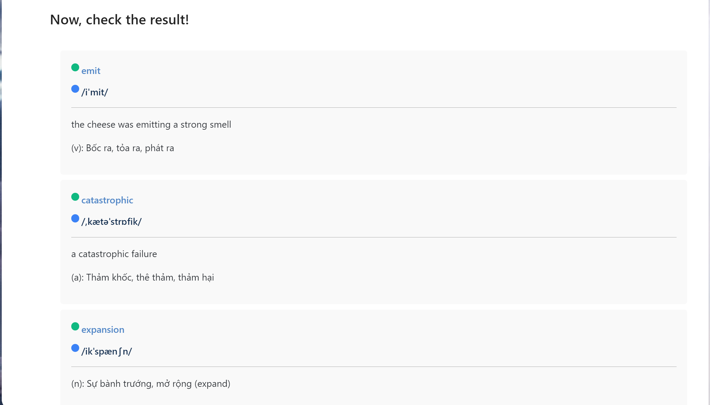

# Notion mailing scheduler

This project help us to schedule sending an email every week from a notion database.

> You could give me a star if this is helpful to you 😊.

## Prerequisites

1. A notion database to store vocab with fields:
   - `Name`, `Short description`, `IPA`, `Example`, `Type` (contains `Vocab`).
   - And `Rand` is the random number with formula:
   ```
   (((((toNumber(substring(replaceAll(id(), "[a-z]", ""), 0, 8)) * 100011979) + 500067713) % 900066731) * (((timestamp(now()) * 800067089) + 800068411) % 800053967)) + 900067309) % 900066571
   ```
   - Clone my notion template: [English template](https://devgiangho.notion.site/English-template-6674b46733b744b8819d039c9df51913?pvs=4)
   - Looks like:
     
2. Create an integration at [notion integration](https://www.notion.so/my-integrations), then claim the secret key of the integration.
3. Share the database with an integration.

   Like this:
   

   Copy the database ID
   

4. Prepare gmail account.

   - Enable 2 factor authentication.
   - Create an application password, use that as credential below.

5. A github account

## Setup

1. Fork this repo into your account.
2. Add secret to your project (it will be "secret")

   - `SENDING_EMAIL`: Sending account.
   - `SENDING_PASSWORD`: Password of the sending account (application password) [See more](https://support.google.com/accounts/answer/185833?hl=en).
   - `DESTINATION_EMAIL`: Your email that will be received email automatically.
   - `NOTION_DB_ID`: Notion database ID.
   - `NOTION_API_KEY`: Notion API key.
   - This looks like:
     

3. Modify the cronjob (optional)

   - How to modify the cronjob? See [Crontab.guru](https://crontab.guru/#*_*_*_*_*)
   - Cronjob will take the UTC timezone, remember adjust your local time!

4. Enjoy and ready to learn!
   - Result:
     
   - Scroll down:
     
